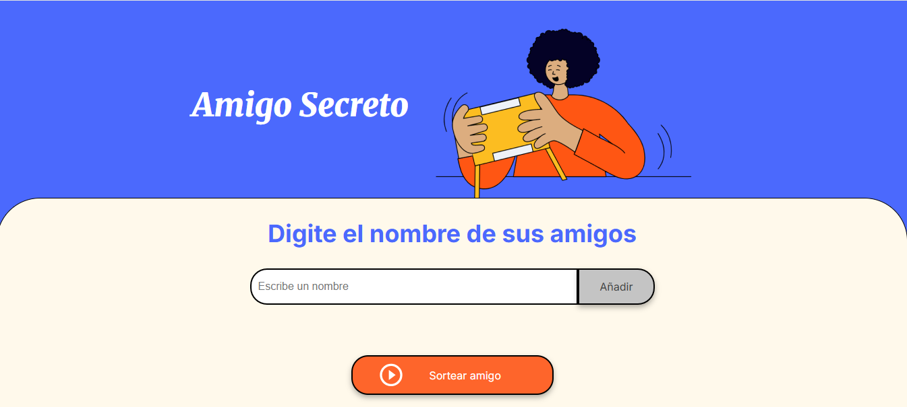

# Amigo Secreto

## Descripción
Esta es una aplicación web en **JavaScript**, **HTML** y **CSS** para realizar un sorteo de "Amigo Secreto". Permite agregar amigos a una lista y seleccionar aleatoriamente un nombre de la lista para asignarle un amigo secreto.

## Características
✅ Agregar nombres a una lista.  
✅ Mostrar la lista de amigos en la interfaz.  
✅ Sortear un amigo secreto aleatoriamente.  
✅ Mostrar el nombre sorteado en pantalla.  
✅ Diseño responsivo y estilizado con **CSS**.

## Tecnologías utilizadas
- **HTML** → Estructura de la interfaz.
- **CSS** → Estilos y diseño de la aplicación.
- **JavaScript** → Lógica del sorteo y manipulación del DOM.

## Instalación y uso
1. **Clonar el repositorio**
   ```sh
   git clone https://github.com/tu-repo/amigo-secreto.git
   ```
2. **Abrir el archivo `index.html` en un navegador.**

## Archivos principales
- **index.html** → Estructura principal de la aplicación.
- **style.css** → Estilos y diseño de la interfaz.
- **app.js** → Lógica del sorteo y manejo del DOM.

## Cómo funciona
1. **Ingresa un nombre en el campo de texto.**
2. **Haz clic en "Añadir"** para agregarlo a la lista.
3. **Repite hasta ingresar todos los amigos.**
4. **Presiona "Sortear amigo"** para elegir un nombre al azar.
5. **El nombre sorteado se mostrará en pantalla.**

## Captura de pantalla


## Mejoras futuras
🔹 Función para eliminar amigos de la lista.  
🔹 Evitar que un amigo se asigne a sí mismo en el sorteo.  
🔹 Guardar los nombres en el almacenamiento local del navegador.  

## Autor
Desarrollado por **Edinson Manga**.
